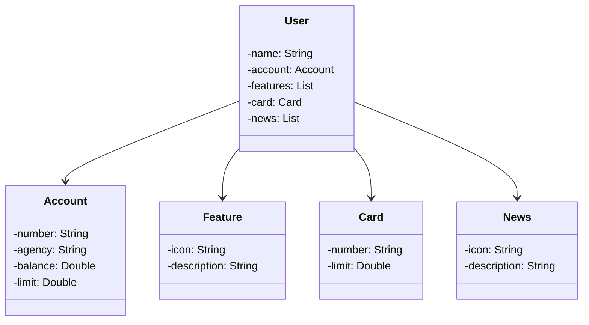

```mermaid
classDiagram
    class User {
        -name: String
        -account: Account
        -features: List<Feature>
        -card: Card
        -news: List<News>
    }

    class Account {
        -number: String
        -agency: String
        -balance: Double
        -limit: Double
    }

    class Feature {
        -icon: String
        -description: String
    }

    class Card {
        -number: String
        -limit: Double
    }

    class News {
        -icon: String
        -description: String
    }

    User --> Account
    User --> Feature
    User --> Card
    User --> News
```
